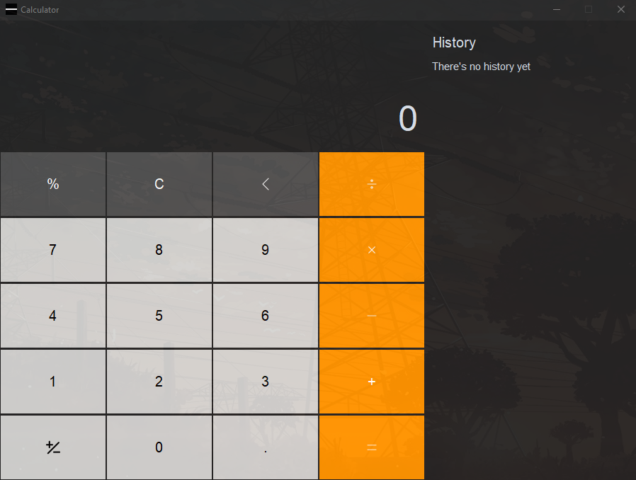

# Calculator App
A simple calculator application built in Python using the customtkinter library. This calculator can handle basic arithmetic operations, including addition, subtraction, multiplication, and division.
It also provides functionality for clearing the input, backspacing, inverting the sign of the number, and calculating percentages.

## Calculator Screenshot




## Features
- Basic arithmetic operations (addition, subtraction, multiplication, division)
- Clear the input
- Backspace to correct mistakes
- Invert the sign of the number
- Calculate percentages
- History of calculations
- Delete previous calculations from history

## Getting Started
### Prerequisites
Before running the application, make sure you have the following installed:

- [Python 3](https://www.python.org/downloads/)
- Python libraries:
  - The customtkinter library (`customtkinter`)
  - The Pillow (PIL) library (`Pillow`)

You can install the required Python libraries by running the following command:

```bash
pip install -r requirements.txt
```

You can install these dependencies using pip:
```bash
pip install customtkinter
pip install Pillow
```

### Installation

1. Clone the repository:
    
    git clone https://github.com/asRot0/Python-projects.git
    
2. Navigate to the Image Viewer directory:

    cd Python-projects/Calculator
    
3. Install the required dependencies:

    pip install -r requirements.txt

### Running the Application
To run the calculator, execute the `calculator.py` script. You can do this from the command line:
```bash
python calculator.py
```

The calculator window will open, and you can start performing calculations.

## Usage
- Enter numbers by clicking the number buttons.
- Perform arithmetic operations by clicking the corresponding buttons.
- Use the "C" button to clear the input.
- Use the "Back" button to delete the last entered digit.
- Click the "%" button to calculate percentages.
- Invert the sign of the number by clicking the "+/-" button.
- History of calculations is displayed in the right panel.
- To delete a calculation from the history, click the "Delete" button.
- Close the application window when you're done.

## Customization
You can customize the appearance of the calculator by modifying the `settings.py` file. You can change colors, fonts, and button sizes to suit your preferences.

### Built With
- [customtkinter](https://github.com/TomSchimansky/CustomTkinter) - A custom-themed version of the Tkinter library.
- [Pillow](https://pillow.readthedocs.io/en/stable/) - The Python Imaging Library for handling images.

## Acknowledgments
- Special thanks to the authors of customtkinter and Pillow for providing these useful libraries.