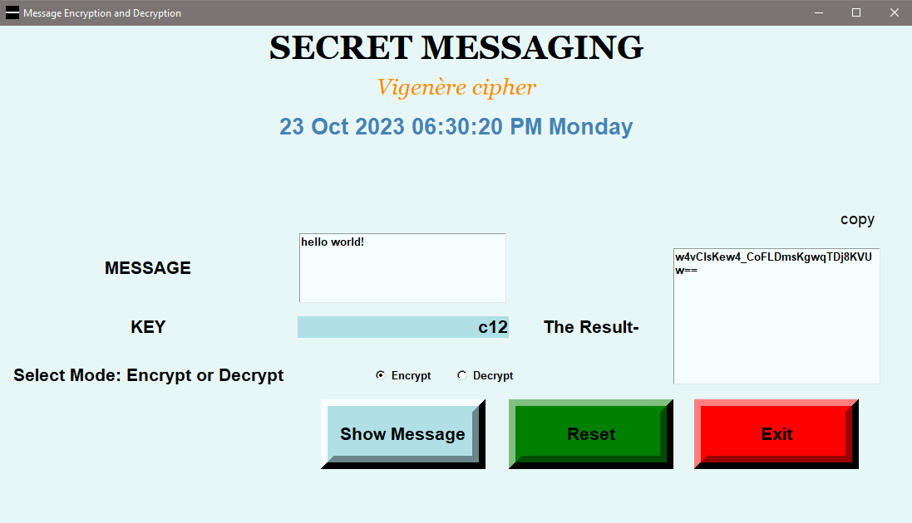

# Message Encryption and Decryption

This is a Python application that allows you to encrypt and decrypt messages using the Vigenère cipher. The application uses the Tkinter library to create a simple graphical user interface (GUI) for easy interaction.

## How to Use

1. Make sure you have Python installed on your computer.
2. Clone this repository or download the code files.
3. Open a terminal or command prompt and navigate to the directory containing the code files.
4. Run the following command to execute the application:

## python <filename.py>

Replace `<filename.py>` with the name of the Python file (e.g., `encode&decode.py`) that contains the code.

1. The application window will open, and you can now use the interface to encrypt or decrypt messages.

## Features

- Enter the message in the "MESSAGE" text box.
- Enter the encryption/decryption key in the "KEY" input field.
- Select the mode (Encrypt or Decrypt) using the radio buttons.
- Click the "Show Message" button to perform the encryption or decryption.
- The result will be displayed in the "The Result-" text box.
- Click the "copy" button to copy the result to the clipboard and paste it into the "MESSAGE" box for decryption.
- Click the "Reset" button to clear the input fields and results.
- Click the "Exit" button to close the application.

## Encryption Algorithm

The application uses the Vigenère cipher to perform encryption and decryption. The Vigenère cipher is a method of encrypting alphabetic text by using a simple form of polyalphabetic substitution.

## Dependencies

The application relies on the following Python modules:

- `tkinter`: Python's standard GUI (Graphical User Interface) package.
- `base64`: To handle encoding and decoding the encrypted message.
- `random`, `time`, and `datetime`: Used for time-related functionalities in the application.

## Prerequisites

- Python 3.6 or above
- Tkinter library

## Installation

1. Clone the repository:

    git clone https://github.com/asRot0/Python-projects.git

2. Navigate to the Message Encode Decode directory:

    cd Python-projects/Message Encode Decode

## Usage

Run the script `encode&decode.py` to start the application:

```bash
1. Enter the message in the "MESSAGE" text box.
2. Enter the encryption/decryption key in the "KEY" input field.
3. Select the mode (Encrypt or Decrypt) using the radio buttons.
4. Click the "Show Message" button to perform the encryption or decryption.
5. The result will be displayed in the "The Result-" text box.
6. Click the "copy" button to copy the result to the clipboard and paste it into the "MESSAGE" box for decryption.
7. Click the "Reset" button to clear the input fields and results.
8. Click the "Exit" button to close the application.
```

## Screenshot




## Note

This application is for educational purposes and is not intended for secure encryption. It uses a simple encryption algorithm and should not be used for sensitive or critical information.

Feel free to explore and modify the code as needed to suit your requirements.
