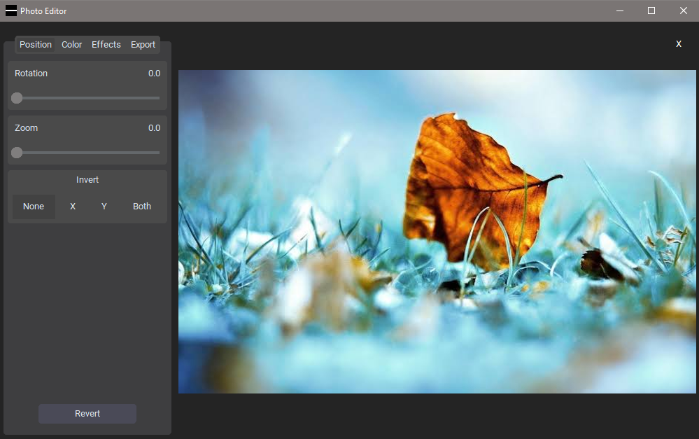
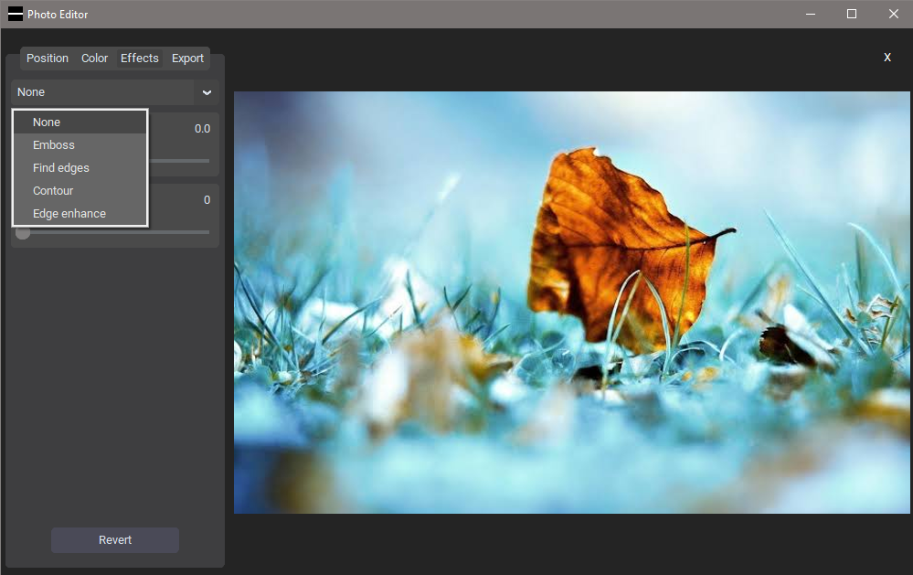

# Photo Editor App

### Overview
The Photo Editor App is a powerful and user-friendly tool for editing and enhancing images. It provides a range of features such as rotation, zoom, color adjustments, and various effects to make your photos look stunning. This document will guide you through the installation process, features, and dependencies of the Photo Editor App.

### Installation
#### Prerequisites
Before you begin, make sure you have the following installed on your system:

- Python (3.6 or later): [Download Python](https://www.python.org/downloads/)
- Pip: [Installing Pip](https://pip.pypa.io/en/stable/installation/)
- Python libraries:
  - customtkinter (`customtkinter`)
  - CTkMessagebox(`CTkMessagebox`)
  - Pillow (`Pillow`)

## Screenshot





## Clone the Repository
```bash
git clone https://github.com/asif7707/Python-projects.git
cd Python-projects/Photo Editor
```

## Install Dependencies
```bash
pip install -r requirements.txt
```

## Run the Application
```bash
python photo_editor.py
```

### Features
- Image Manipulation:
  - Rotation
  - Zoom
  - Flip (X, Y, Both)
- Color Adjustments:
  - Brightness
  - Grayscale
  - Invert
  - Vibrance
- Effects:
  - Blur
  - Contrast
  - Various artistic effects (Emboss, Find edges, Contour, Edge enhance)
- Export Options:
  - Save edited images in different formats (JPG, PNG)
  - Choose output directory
- Revert Changes:
  - Easily revert all changes with the "Revert" button
- User Interface:
  - Dark mode
  - Responsive design

## Usage
1. Open the application using `python photo_editor.py`.
2. Use the "Open Image" button to import an image.
3. Explore the tabs (Position, Color, Effects, Export) for editing options.
4. Adjust sliders, switches, and dropdowns to modify the image.
5. Click the "Save" button to export the edited image.

## Dependencies
The Photo Editor App relies on the following Python packages:

- `customtkinter`: A customized version of the Tkinter library.
- `Pillow`: An imaging library to handle image-related operations.

These dependencies are listed in the `requirements.txt` file and can be installed using the provided instructions.

## Customization
You can customize the appearance of the photo editor by modifying the `settings.py` file. You can change colors, default values to suit your preferences.

### Built With
- [customtkinter](https://github.com/TomSchimansky/CustomTkinter) - A custom-themed version of the Tkinter library.
- [Pillow](https://pillow.readthedocs.io/en/stable/) - The Python Imaging Library for handling images.

## Acknowledgments
- Special thanks to the authors of customtkinter and Pillow for providing these useful libraries.