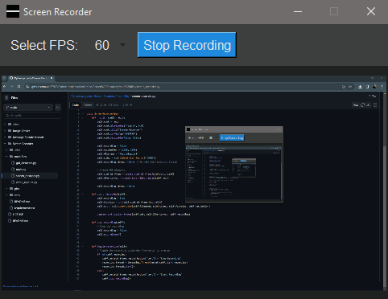

# Screen Recorder

## Introduction

The Screen Recorder is a simple Python application that allows you to capture your computer screen and save it as a video. This tool is particularly useful for creating tutorials, recording presentations, or capturing any on-screen activities.

## Features

- Record your screen activity to a video file.
- Choose the frames per second (FPS) for recording.
- Simple and user-friendly graphical user interface.
- Start and stop recording with the press of a button.
- Real-time preview of the recording.

## Prerequisites

Before running the application, make sure you have the following dependencies installed:

- [Python 3](https://www.python.org/downloads/)
- Python libraries:
  - OpenCV (`opencv-python`)
  - NumPy (`numpy`)
  - PyAutoGUI (`pyautogui`)

You can install the required Python libraries by running the following command:

```bash
pip install -r requirements.txt
```

## Installation
1. Clone or download this repository to your local machine.

2. Navigate to the project directory using the command line.

3. Install the required libraries using the command mentioned above.

## Usage
1. Run the application by executing main.py:
```bash
python main.py
```
2. The application's GUI will open.

3. Choose your desired Frames Per Second (FPS) for recording.

4. Click the "Start Recording" button to begin recording your screen. The button will change to "Stop Recording."

5. To stop recording, click the "Stop Recording" button.

6. Your recorded video will be saved in the project directory with the name "Recording.avi."

## Customization
You can customize the application by modifying the following files:

- `main.py`: This file initializes the application and the GUI.
- `gui_elements.py`: Modify this file to change the GUI layout and appearance.
- `screen_recorder.py`: Customize the screen recording settings and behavior.
- `video_capture.py`: Adjust the screen capture and display logic.

## Contributing
Contributions are welcome! Feel free to open issues and pull requests to enhance this Screen Recorder tool.

## Screenshot



## Acknowledgments
- This project was inspired by the need for a simple screen recording tool.
- Thanks to the open-source community for the libraries and tools used in this project.


Enjoy recording your screen with the Screen Recorder application!

```vbnet
You can create a `README.md` file in your project's root directory, paste the above content,
and modify it as needed.
```